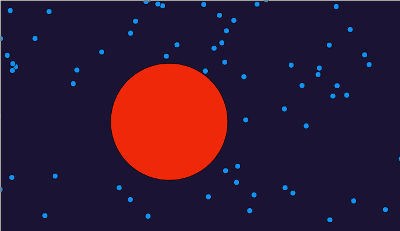
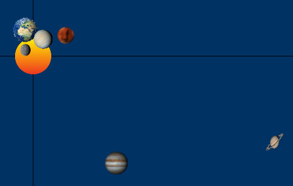
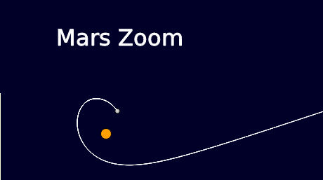
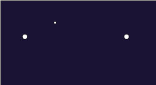
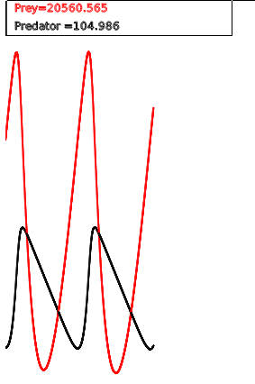
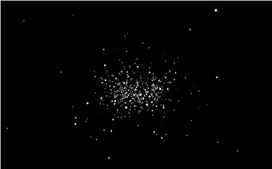
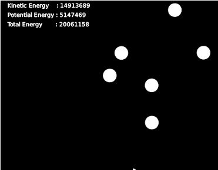
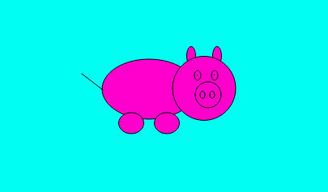

A progression in six steps
==========================

The six steps in this progression allows the learner to get acquainted with
 * variables
 * coordinate systems
 * functions
 * differential equations
 * the law of gravity
 * elementary Javascript and ProcessingJS syntax

Step 0: Simple animation
------------------------
Step 0 consists of coding a program that shows an ellipse moving in the coordinate system.

This can be done with

```
var x=300;
var y=300;

draw = function() {
    background(26, 19, 51);
    fill(255, 255, 0);
    ellipse(200, 200, 20, 20); //the Sun
    fill(73, 189, 209);
    ellipse(x, y, 10, 10); //the Earth
    x=x+1;
    y=y+1;
};
```

Copy paste the code above into
https://www.khanacademy.org/computer-programming/new/pjs

Try and play with the initial x and y values. What happens?

Try and change the line y = y + 1; to y = y + 3; What happens?


Step 1: One-body gravity
------------------------
In step 1 we introduce a motion resembling gravitational attraction, as explained in
​​https://www.youtube.com/watch?v=T6CN1MQW7nQ

Try modifying the gravitational constant G=1 and the mass of the bodies. What happens?


Step 2: Two-body gravity
------------------------
Extend the program such that both bodies now attract each other.


Step 3: Three-body gravity
--------------------------
In this step we introduce a third body. In the previous step we needed to calculate a single distance, d.

How many distances between the different bodies - how many variables - do we need to calculate now?

When a body is being attracted by two other bodies, how do the accelerations combine?


Step 4: Simplifying the code with a function
--------------------------------------------
In the previous step, the integration part

```
var xpp= - 3000 * x/Math.pow(d, 3);
var ypp= - 3000 * y/Math.pow(d, 3);
xp=xp+xpp*dt;
yp=yp+ypp*dt;
x=x+xp*dt;
y=y+yp*dt;
```

appears almost identically three times.

Factor it into a function that can be called for each body.

Step 5: Generalizing the code to N bodies
-----------------------------------------
Generate an array of bodies and make them all interact with each other.


An then...
----------

Afterwards, you will be able to (teach the children how to):

### explain air resistance

[](https://ecolefrancodanoise.github.io/de-for-children/processingjs/p5/elastic-collisions.html)

### simulate a solar system

[](https://ecolefrancodanoise.github.io/de-for-children/processingjs/p5/solar-system.html)

### simulate a trip to Mars

[](https://ecolefrancodanoise.github.io/de-for-children/processingjs/p5/mars-trip.html)

### simulate an electron trajectory between two dihydrogen protons (paving the way for understanding quantum mechanics)

[](https://ecolefrancodanoise.github.io/de-for-children/processingjs/p5/dihydrogen-cation.html)

### simulate an ecosystem consisting of predators and preys

[](https://ecolefrancodanoise.github.io/de-for-children/processingjs/p5/predator-prey-model.html)

### witness the beauty of star formation

[](https://ecolefrancodanoise.github.io/de-for-children/processingjs/p5/nebula-simulation.html)

### understand how gases, liquids, pressure, heat etc. all work together

[](https://ecolefrancodanoise.github.io/de-for-children/processingjs/p5/n-body-collisions.html)

### or simply a "cochon différentiel"

[](https://ecolefrancodanoise.github.io/de-for-children/processingjs/p5/cochon-differentiel.html)


[to be continued]
